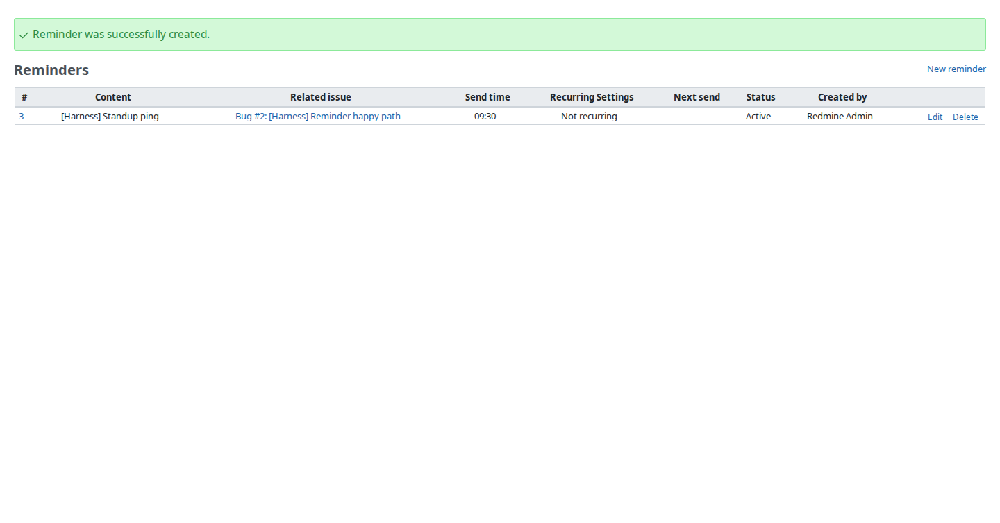
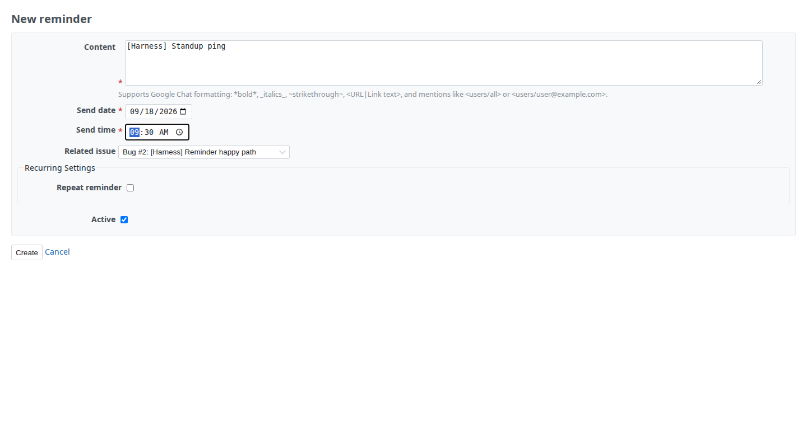
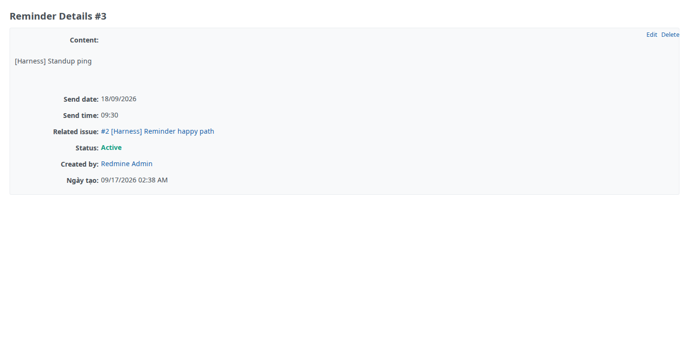

# Redmine Reminder — Slack & Google Chat Notifications with Scheduled Reminders

[](https://redmineshop.com/products/redmine-reminder)
[](https://redmineshop.com/docs/compatibility)
[](LICENSE.md)

**Last maintained:** 2026-09-18

**Source on GitHub:** [github.com/redmineshop/redmine_reminder](https://github.com/redmineshop/redmine_reminder)

Schedule recurring reminders for Redmine projects — delivered as Slack or Google Chat notifications. Set once, send on schedule, link to issues.

## Features

- Create reminders for any Redmine project
- Schedule for a specific date/time or recur (daily, weekdays, weekly, custom days)
- Link reminders to specific Redmine issues
- Send notifications to Slack webhook or Google Chat space webhook
- Per-project notification settings (channel, icon, username override)
- Project module toggle — enable only on relevant projects
- `view_reminders` / `manage_reminders` role permissions
- Multi-language: English, Vietnamese, Japanese

## Requirements

- Redmine 5.0.x or 6.x
- Ruby 3.0+
- A Slack incoming webhook URL or Google Chat space webhook URL

## Installation

Clone from GitHub, then migrate:

```bash
cd /path/to/redmine/plugins
git clone https://github.com/redmineshop/redmine_reminder.git
cd /path/to/redmine
bundle exec rake redmine:plugins:migrate RAILS_ENV=production
# Restart your Redmine server
```

See the [install guide](https://redmineshop.com/docs/reminder-install) for full instructions.

## Configuration

1. Admin → Plugins → Redmine Reminder → Configure
2. Set your Slack or Google Chat webhook URL
3. Enable the "Reminders" module on each project (Project Settings → Modules)

## Cron setup (recurring reminders)

Add to your cron to trigger reminder dispatch:

```cron
*/15 * * * * cd /path/to/redmine && bundle exec rake redmine:reminders:send RAILS_ENV=production
```

## Troubleshooting

See [docs/reminder-troubleshooting](https://redmineshop.com/docs/reminder-troubleshooting) or open an issue at [GitHub Issues](https://github.com/redmineshop/redmine_reminder/issues).

## Compatibility

| Redmine | Ruby | Database | Status |
|---------|------|----------|--------|
| 6.x     | 3.2+ | MySQL 8 / PostgreSQL | Targeted — **untested** (no published QA matrix) |
| 5.1.x   | 3.1+ | MySQL 8 / PostgreSQL | Targeted — **untested** |
| 5.0.x   | 3.0+ | MySQL 8 / PostgreSQL | Targeted — **untested** |

The plugin declares `requires_redmine version_or_higher: '5.0'`. Do not treat catalog versions as tested cells.

## Screenshot

Reminders index on a project (demo Redmine, plugin quality harness):



Create form:



Detail view:



Screenshot refresh is a private-monorepo Playwright job (`demo/scripts/run-plugin-e2e.sh`), not something a public clone can run.

## Tests

MiniTest lives under `test/` (unit + functional). Coverage is **partial** — Reminder validations/schedule and `RemindersController` `#index` / `#create` / `#show`. It does **not** yet cover edit/update/destroy, webhook POST, or cron dispatch. Public sibling CI (`.github/workflows/ci.yml`) is Ruby syntax only (`ruby -c`). That is not the quality bar. This plugin is **not** shippable on MiniTest alone.

On a Redmine install that already has this plugin migrated:

```bash
bundle exec rake redmine:plugins:test NAME=redmine_reminder RAILS_ENV=test
```

On the private RedmineShop demo stack (monorepo only):

```bash
PLUGIN_NAME=redmine_reminder ./demo/scripts/run-sso-plugin-tests.sh
```

### Quality harness (demo + E2E)

The Playwright E2E harness lives in the **private** RedmineShop monorepo (`docker-compose.demo.yml` + `demo/scripts/run-plugin-e2e.sh`). This public GitHub repo is the plugin only — it does not ship that compose file, and a public clone cannot open monorepo docs such as `docs/plugin-quality-harness.md`. There is no public-safe copy of that harness guide.

Install and smoke this plugin on your own Redmine: [reminder install](https://redmineshop.com/docs/reminder-install).

| Bar | Status |
| --- | --- |
| Automated tests beyond `ruby -c` | **Partial** — `test/unit/reminder_test.rb` + `test/functional/reminders_controller_test.rb` (index/create/show). Not a full MiniTest suite (no webhook POST, cron, or edit/update/destroy) |
| Installed + enabled on demo Redmine | **Verified** — mounted via `demo/plugins/` on the monorepo demo stack; seed enables the Reminders module on `plugin-qa` |
| E2E primary happy path | **Verified** — Playwright `demo/e2e/tests/redmine_reminder.spec.js` (open UI, create, view) on the demo stack |
| UI screenshot in README | **Verified** — `screenshots/{reminder-new-form,reminders-list,reminder-detail}.png` from that spec |
| Redmine 5.1 / 6.x matrix | **Declared / untested** — this harness is one demo image, not a QA matrix |

## License

MIT — see [LICENSE.md](LICENSE.md). Based on [sciyoshi/redmine-slack](https://github.com/sciyoshi/redmine-slack).
