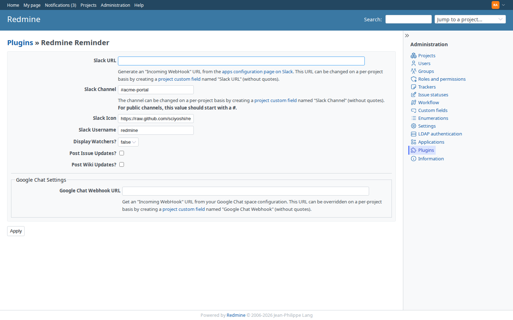
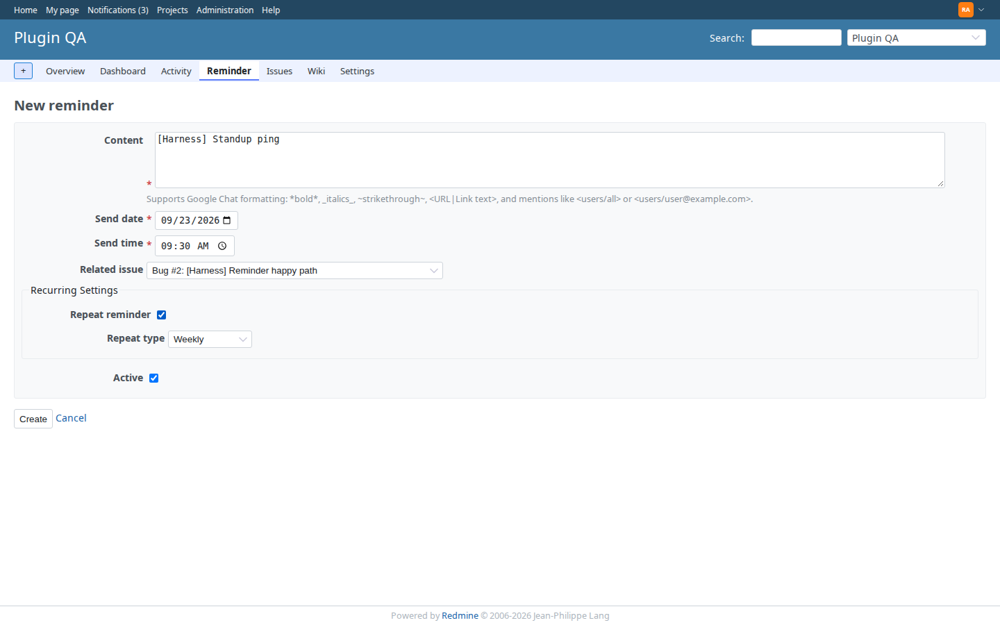
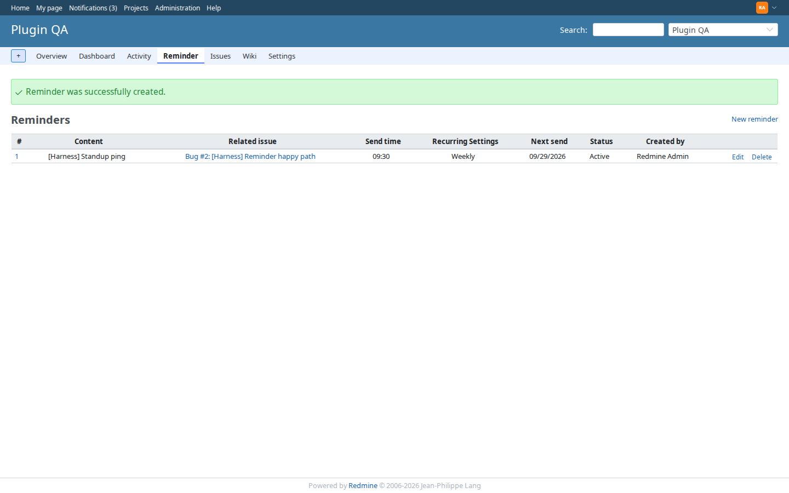
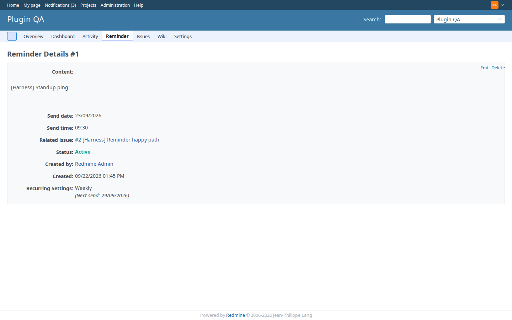

# Redmine Reminder — Slack & Google Chat Notifications with Scheduled Reminders

[](https://redmineshop.com/products/redmine-reminder)
[](LICENSE.md)
[](https://github.com/redmineshop/redmine_reminder/actions/workflows/ci.yml)

**Last maintained:** 2026-09-22

**Source on GitHub:** [github.com/redmineshop/redmine_reminder](https://github.com/redmineshop/redmine_reminder)

Slack and Google Chat reminders for Redmine.

Schedule recurring reminders for Redmine projects — delivered as Slack or Google Chat notifications. Set once, send on schedule, link to issues.

## Features

- Create reminders for any Redmine project
- Schedule for a specific date/time or recur (daily, weekdays, weekly, custom days)
- Link reminders to specific Redmine issues
- Send notifications to Slack webhook or Google Chat space webhook
- Per-project notification settings (channel, icon, username override)
- Project module toggle — enable only on relevant projects
- `view_reminders` / `manage_reminders` role permissions
- Multi-language: English, Vietnamese, Japanese

## Requirements

- Redmine 5.0.x or 6.x
- Ruby 3.0+
- A Slack incoming webhook URL or Google Chat space webhook URL

## Installation

Clone from GitHub, then migrate:

```bash
cd /path/to/redmine/plugins
git clone https://github.com/redmineshop/redmine_reminder.git
cd /path/to/redmine
bundle exec rake redmine:plugins:migrate NAME=redmine_reminder RAILS_ENV=production
# Restart your Redmine server
```

After restart, open **Administration → Plugins** and confirm **Redmine Reminder** is listed.

See the [install guide](https://redmineshop.com/docs/reminder-install) for full instructions.

## Configuration

1. **Administration → Plugins → Redmine Reminder → Configure**
2. Set your Slack or Google Chat webhook URL
3. Enable the "Reminders" module on each project (Project Settings → Modules)

## Cron setup (recurring reminders)

Add to your cron to trigger reminder dispatch:

```cron
*/15 * * * * cd /path/to/redmine && bundle exec rake redmine:reminders:send RAILS_ENV=production
```

## Troubleshooting

See [docs/reminder-troubleshooting](https://redmineshop.com/docs/reminder-troubleshooting) or open an issue at [GitHub Issues](https://github.com/redmineshop/redmine_reminder/issues).

## Compatibility

Declared follows `requires_redmine version_or_higher: '5.0'` for 5.x and 6.x. Redmine 7.0 is not a claimed target. Tested means a run pinned to that Redmine line. The demo image is official `redmine:latest` (tag not pinned), so a demo boot is not a pass for a specific row.

| Redmine | Declared | Tested |
|---------|----------|--------|
| 5.0.x   | Yes      | No — unverified |
| 5.1.x   | Yes      | No — unverified |
| 6.0.x   | Yes      | No — unverified |
| 6.1.x   | Yes      | No — unverified |
| 7.0.x   | No       | No — unverified |

## Screenshots

Plugin settings. Webhook URL fields are masked. The channel in the shot is the fake name `#acme-portal` (display only; the harness does not save it).



New reminder on the sample project, linked to an issue, set to repeat weekly:







Screenshot refresh lives in the private `redmineshop/redmineshop` harness. A public clone cannot run it.


## Tests

MiniTest lives under `test/` (unit + functional). Coverage is partial: Reminder validations and schedule, plus `RemindersController` `#index`, `#create`, and `#show`. It does not cover edit, update, destroy, webhook POST, or cron dispatch.

Public GitHub Actions (`.github/workflows/ci.yml`) runs Ruby syntax checks only (`ruby -c`).

On a Redmine install that already has this plugin migrated:

```bash
bundle exec rake redmine:plugins:test NAME=redmine_reminder RAILS_ENV=test
```

## Limits

- Delivery is Slack or Google Chat webhooks. This plugin does not send email reminders.
- Recurring sends need the cron rake task. Without cron, only the saved schedule exists.
- MiniTest does not boot Redmine 5.0, 5.1, 6.0, 6.1, or 7.0, and does not call a webhook.
- Install notes: [reminder install](https://redmineshop.com/docs/reminder-install).

## License

MIT — see [LICENSE.md](LICENSE.md). Based on [sciyoshi/redmine-slack](https://github.com/sciyoshi/redmine-slack).
